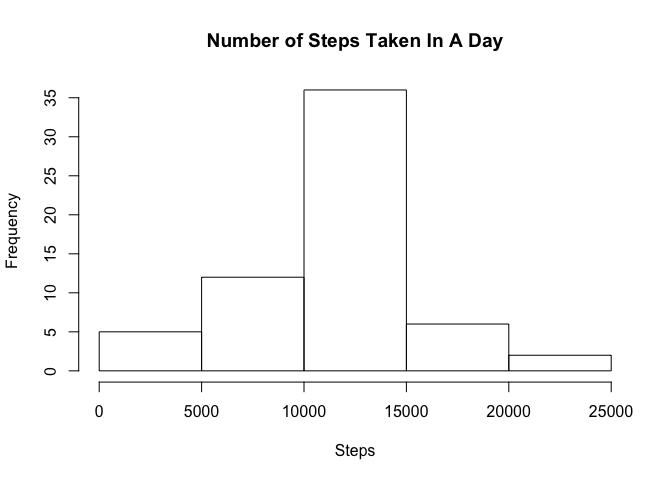

## Loading and preprocessing the data


This report uses data from personal activity moniotring devices to explore patterns in behaviour and movement.

The data was downloaded from https://d396qusza40orc.cloudfront.net/repdata%2Fdata%2Factivity.zip and using r, I read in the .csv file and then a subset was created with the NA values removed:
    

```r
data <- read.table("activity.csv", header = TRUE, sep = ",", na.strings = "NA")
data.clean <- na.omit(data)
```


## What is mean total number of steps taken per day?


Before calculating the mean steps per day, the aggregate function is used to sum the total steps per day and then plotted to show frequency:
    

```r
dailyStep <- aggregate(data.clean$steps, by= list(Category = data.clean$date),
                       FUN = sum)
hist(dailyStep$x, main = "Number of Steps Taken In A Day", xlab = "Steps")
```

<!-- -->

The mean and median can then be calculated into placeholders variables:
    

```r
meanSteps <- mean(dailyStep$x)
medianSteps <- median(dailyStep$x)
```

and printed out in the console:


```r
meanSteps
```

```
## [1] 10766.19
```

```r
medianSteps
```

```
## [1] 10765
```


## What is the average daily activity pattern?


To find daily activity patterns the aggregate function is used, this time to calculate the mean based on five minute increments. The base plotting system is used to create the time series plot:
    

```r
interval <- aggregate(data.clean$steps, by = list(Category = data.clean$interval),
                      FUN = mean)
colnames(interval) <- c("Interval", "Steps")
plot(interval, type = "l", main = "Average Steps by 5-min Interval",
     ylab = "Average Steps", xlab = "Time Interval")
```

<!-- -->

The following is used to subset the interval data to pull out the max number of average steps and when during the day it occurs:
    

```r
max.step <- interval[interval$Steps == max(interval$Steps), ]
max.step
```

```
##     Interval    Steps
## 104      835 206.1698
```

Therefore, the maximum average steps in a 5-min interval is 206.1698 and it occurs during the 835 interval (The 104th interval period in the list). The time series plot appears to support this outcome.


## Imputing missing values


Up to this point the NA values have been excluded from exploratory analysis. This data set denotes missing values by "NA" and the proportion of missing values can be calculated using the following:
    

```r
no.val <-round(mean(is.na(data)), digits = 3)
cat(no.val*100, "%")
```

```
## 4.4 %
```

Alternatively, by comparing the clean and uncleaned data I can calculate the number of intervals where data is missing:
    

```r
nrow(data) - nrow(data.clean)
```

```
## [1] 2304
```

Out of the 17568 observations in the data set, 2304 have missing values; which is approximately 4.4%.

For the next task I need to install the dplyr library:
    

```r
library(dplyr)
```

The next step was to take the original data set and replace the NA values. The following operation finds all the NA values and then calculates the mean for that 5-min interval and fills in the blank:
    

```r
filled <- data %>%
    group_by(interval) %>%
    mutate(steps = ifelse(is.na(steps), mean(steps, na.rm = TRUE), steps))
filled$steps <- round(filled$steps, digits = 2)
```

The round function was applied to round the means to the nearest hundredth. Now printing the filled in data set you will see the NA values have been replaced by the means of that value's specific interval:


```r
head(filled, 10)
```

```
## # A tibble: 10 x 3
## # Groups:   interval [10]
##    steps date       interval
##    <dbl> <fct>         <int>
##  1  1.72 2012-10-01        0
##  2  0.34 2012-10-01        5
##  3  0.13 2012-10-01       10
##  4  0.15 2012-10-01       15
##  5  0.08 2012-10-01       20
##  6  2.09 2012-10-01       25
##  7  0.53 2012-10-01       30
##  8  0.87 2012-10-01       35
##  9  0    2012-10-01       40
## 10  1.47 2012-10-01       45
```

Just as before, I can produce a histogram showing the frequency of values for the daily step count and calculate the mean and median values:


```r
dailyStep2 <- aggregate(filled$steps, by= list(Category = filled$date), FUN = sum)
hist(dailyStep2$x, main = "Number of Steps Taken In A Day", xlab = "Steps")
```

<!-- -->

```r
meanSteps2 <- mean(dailyStep2$x)
medianSteps2 <- median(dailyStep2$x)
meanSteps2
```

```
## [1] 10766.18
```

```r
medianSteps2
```

```
## [1] 10766.13
```


```r
meanSteps2 - meanSteps
```

```
## [1] -0.007695639
```

```r
medianSteps2 - medianSteps
```

```
## [1] 1.13
```

Comparing the means and medians for the incomplete and filled data shows that by imputing the interval specific mean in the missing values results in little impact on the overall mean, whereas the median sees an increase in over 1 step.


## Are there differences in activity patterns between weekdays and weekends?


For easier manipulation of date information, I converted the date column from a factor variable into a date variable:


```r
data.clean$date <- as.Date(data.clean$date, "%Y-%m-%d")
```

Next task is to sort the data values based on whether it occurs during the week or weekend:


```r
df <- mutate(data.clean, wkd = weekdays(data.clean$date))
wknd <- filter(df, wkd == "Saturday" | wkd == "Sunday")
wkdy <- filter(df, wkd == "Monday" | wkd ==  "Tuesday" | wkd ==  "Wednesday" |
                   wkd == "Thursday" | wkd == "Friday")
```

Next I aggregated the means for each interval for both weekdays and weekends and plotted the time series plots; after setting a few plotting parameters:


```r
par(mfrow = c(2, 1), mar = c(5, 5, 0, 0))
wkdy.int <- aggregate(wkdy$steps, by = list(Category = wkdy$interval),
                      FUN = mean)
wknd.int <- aggregate(wknd$steps, by = list(Category = wknd$interval),
                      FUN = mean)
plot(wkdy.int, type = "l", ylab = "Average Steps", xlab = "Time Interval")
title("Average Weekday Steps", line = -1, adj = 0.9)
plot(wkdy.int, type = "n", ylab = "Average Steps", xlab = "Time Interval")
lines(wknd.int, type = "l")
title("Average Weekend Steps", line = -1, adj = 0.9)
```

<!-- -->
